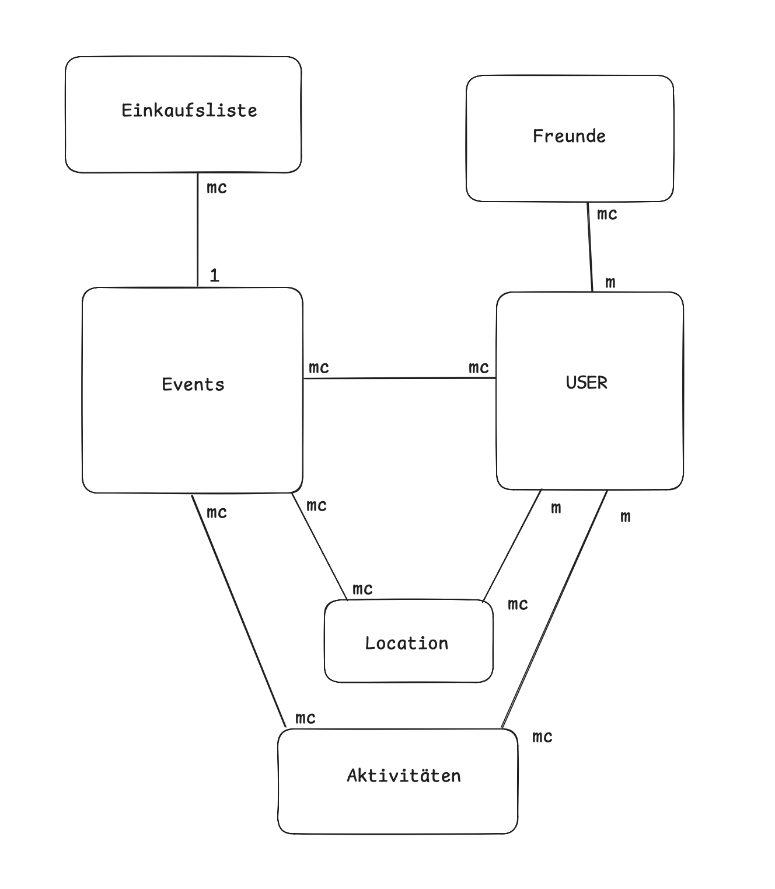

# Projektname: PreGame

**Projektauftraggeber:** Prof. Natascha Rammelmüller, Prof. Robert Reder 
**Projektleiter:** Payreder Tobias, t.payreder@students.htl-leonding.ac.at, +43 676 4160615

**Projekthintergrund:**
Auf der Seite PreGame kann man einen Abend mit seinen Freunden Planen, Einkaufslisten erstellen, Kosten splitten und vieles mehr! Gekommen bin ich zu der Idee, dadurch dass meine Freunde und ich in der Vergangenheit immer etwas schlecht im Planen von Treffen waren, doch das soll sich mit PreGame ändern!

**USP:**
Die Seite plant Events automatisch. Einzigartige Features sind:
- Teilnehmer eingeben
- Budget eingeben
- Locations abstimmen
- App berechnet:
  - wie viel Alkohol/Snacks/Spiele
  - wer was kaufen soll
  - Preis pro Person

**UI & UX | Projekt aus Sicht des Users:**
PreGame wird Hauptsächlich in Handyformat verfügbar sein. Je nach dem (nach meiner Meilensteinliste) wird sich ergeben, ob es auch im Laptopformat verfügbar sein wird. Aber ganz klar gilt, die Website wird Smartphone-first programmiert. Farben werden sich an dunklem grau/dunklem lila verbleiben.

**Coder Plan:**
Verwendete **Technologien** werden
- HTML
- CSS
- JS
- php
- MySQL

... **Datenbank** wird ungefähr so aussehen:

